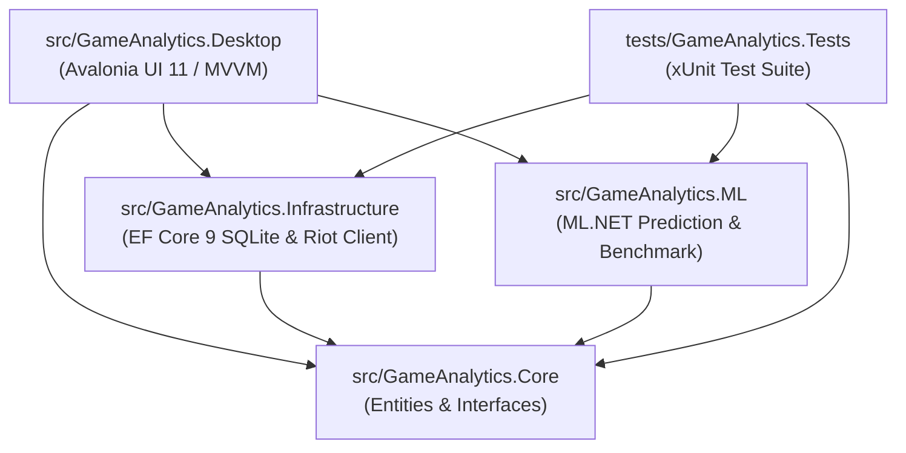

# GameAnalytics — Мультиплатформна система аналізу та прогнозування результатів у змагальних іграх

[](https://github.com/Qu4dyz/multiplatform/actions/workflows/build-and-test.yml)
[](https://dotnet.microsoft.com/)
[](https://avaloniaui.net/)
[](https://dotnet.microsoft.com/apps/machinelearning-ai/ml-dotnet)
[]()
[-green.svg)]()
[](LICENSE)

Курсовий проєкт з навчальної дисципліни **«Мультиплатформне програмування»**.  
**Автор:** [@Qu4dyz](https://github.com/Qu4dyz)  
**Предметна область:** Аналіз соревновальних рейтингових матчів (League of Legends через Riot Games API), збір внутрішньоігрової статистики (склади команд, показники чемпіонів, об'єкти карти, перевага за золотом) та прогнозування ймовірності перемоги методами машинного навчання.

---

## 🎯 Мета та завдання проєкту

Головна мета — розробка високопродуктивної, повністю кросплатформеної системи на базі сучасного стеку .NET, яка забезпечує:
1. **Аналітику гравців:** Отримання актуальної інформації про обліковий запис гравця, його ранг, KDA, популярних чемпіонів та відсоток перемог (Win Rate).
2. **Інтерактивний 5v5 драфт чемпіонів:** Вибір сетапів для кожної позиції (Top, Jungle, Mid, Bot, Support) з автоматичним розрахунком командних вінрейтів та синергії.
3. **ML-прогнозування результату (ML.NET):** Розрахунок ймовірності перемоги на основі драфту та метрик 15-ї хвилини матчу (перша кров, вежа, дракон, різниця за золотом і вбивствами) трьома алгоритмами бінарної класифікації (`FastTree`, `FastForest`, `SdcaLogisticRegression`).
4. **Бенчмаркінг моделей машинного навчання:** Порівняльний аналіз швидкодії та точності класифікаторів (AUC-ROC, Accuracy, F1-Score, час тренування) у реальному часі.
5. **Історію та кешування матчів:** Локальне зберігання звітів та метрик у реляційній базі даних **SQLite** за допомогою **Entity Framework Core**.
6. **Уніфікований нативний інтерфейс:** Однаковий сучасний графічний інтерфейс у фірмовій темній стилістиці (League Dark/Hextech Theme) під ОС **Windows** та **Linux (Ubuntu/Debian)** без зміни жодного рядка коду.

---

## 🛠 Технологічний стек

| Компонент | Технологія / Бібліотека | Опис |
| :--- | :--- | :--- |
| **Мова та платформа** | **C# 13 / .NET 9** | Сучасне ядро з найвищою продуктивністю та повною кросплатформеністю |
| **Графічний інтерфейс (GUI)** | **Avalonia UI 11** | Кросплатформенний UI фреймворк на базі XAML з нативним апаратним рендерингом |
| **Архітектурний патерн** | **MVVM (Model-View-ViewModel)** | Реалізовано за допомогою `CommunityToolkit.Mvvm` (Source Generators) |
| **Машинне навчання (ML)** | **ML.NET (FastTree, FastForest, SDCA)** | Бінарна класифікація, калібрування ймовірностей (Platt Calibrator), чутливість ознак |
| **База даних & ORM** | **SQLite + Entity Framework Core 9** | Локальне реляційне кешування, зв'язки сутностей (1:N), швидкі транзакції |
| **Мережевий шар** | **HttpClient + System.Text.Json** | Riot Games API (v4/v5, Data Dragon CDN), обробка рейт-лімітів (429 Sliding Window) |
| **CI/CD** | **GitHub Actions Matrix** | Автоматична компіляція та виконання тестів на `ubuntu-latest` і `windows-latest` |

---

## 🏗 Архітектура рішення (.NET Solution)

Проєкт побудовано за принципами чистої модульної архітектури (**Clean Architecture**):

```
GameAnalytics/
├── .github/
│   ├── workflows/
│   │   └── build-and-test.yml     # Multiplatform GitHub Actions CI Matrix (Linux + Windows)
│   └── ISSUE_TEMPLATE/            # Шаблони баг-репортів та запитів на фічі
├── src/
│   ├── GameAnalytics.Core/         # Доменний шар: сутності (Match, Participant), перерахування, інтерфейси
│   ├── GameAnalytics.Infrastructure/ # Інфраструктура: EF Core (SQLite DbContext), Riot API клієнт, DDragon CDN
│   ├── GameAnalytics.ML/          # Машинне навчання: фічі (MatchInputFeatures), бенчмаркінг, пайплайни ML.NET
│   └── GameAnalytics.Desktop/     # Презентаційний шар: Avalonia UI (Views, ViewModels, Converters)
├── tests/
│   └── GameAnalytics.Tests/       # Модульне тестування (xUnit, 15 тестів для ML, EF Core, Repositories)
├── README.md                      # Детальна документація проєкту
└── GameAnalytics.sln              # Файл Solution
```

### Граф залежностей проєктів:


---

## 🖥 Розділи графічного інтерфейсу (Avalonia UI)

1. **🔍 Аналітика гравця (`PlayerAnalyticsView`):**
   - Пошук за Riot ID (наприклад `Qu4dyz#EUW` або `Faker#KR1`).
   - Відображення аватара, рівня, рангу (Solo/Duo Tier: Challenger, Master, Diamond тощо).
   - Загальний вінрейт, KDA, статистика останніх рейтингових матчів.
2. **🧠 Аналіз драфту та ML-передбачення (`DraftPredictionView`):**
   - Інтерактивна 5v5 арена драфту (Top, Jungle, Mid, Bot, Support) для Синьої та Червоної команд.
   - Каталог чемпіонів з іконками Data Dragon CDN, фільтрацією за ролями (Fighter, Mage, Assassin, Tank тощо) та пошуком.
   - Налаштування показників 15-ї хвилини гри (слайдери Gold Diff, Kill Diff, вежі, дракони, First Blood/Tower).
   - Динамічний вибір алгоритму класифікації (`FastTree`, `FastForest`, `SdcaLogisticRegression`).
   - Візуалізація прогнозів: відсоткова шкала перемоги, перелік ключових факторів чутливості (Feature Importance).
   - Вбудований бенчмарк для порівняння точності (Accuracy, AUC-ROC) на 2 000+ вибірок.
3. **📊 Історія матчів (`MatchHistoryView`):**
   - Перегляд збережених у локальній базі даних SQLite матчів.
   - Детальна статистика кожного учасника (K/D/A, CS, золото, урон, статус перемоги).
4. **⚙️ Налаштування та сервер (`SettingsView`):**
   - Конфігурація Riot API ключа та вибір регіону сервера (`eun1`, `euw1`, `na1`, `kr`).
   - Перемикання між Live API та демонстраційним режимом (Mock Mode).
   - Моніторинг розміру файлу локальної бази даних SQLite з можливістю очищення.
   - Відображення статусу поточної ОС клієнта та підключеного віддаленого **Linux VPS** (`45.77.53.46`, Ubuntu 24.04 LTS).

---

## 💻 Підтримувані платформи та системні вимоги

### 1. Windows (10 / 11 x64 / arm64)
- Встановлений **.NET 9 SDK** (або новіший).
- Графічний адаптер із підтримкою DirectX 11 / OpenGL.

### 2. Linux (Ubuntu 22.04 / 24.04 LTS, Debian 11 / 12 x64)
Застосунок успішно розгорнуто та верифіковано на **Ubuntu 24.04 LTS (x86_64)**.
Для запуску графічної підсистеми Avalonia потрібні системні бібліотеки:
```bash
sudo apt update
sudo apt install -y libx11-6 libx11-xcb1 libxcursor1 libxi6 libxrandr2 \
                    libfontconfig1 libice6 libsm6 libgl1-mesa-glx libc6
```

---

## 🚀 Інструкція зі збирання, тестування та запуску

### Крок 1. Клонування репозиторію
```bash
git clone https://github.com/Qu4dyz/multiplatform.git
cd multiplatform
```

### Крок 2. Відновлення пакетів та компіляція
```bash
# Відновити всі NuGet-залежності
dotnet restore

# Зібрати проєкт у конфігурації Release
dotnet build GameAnalytics.sln -c Release
```

### Крок 3. Запуск модульних тестів
```bash
# Запуск 15 тестів (DataLayer, MLBenchmark, PredictionEngine, Repositories)
dotnet test GameAnalytics.sln
```

### Крок 4. Запуск десктопного застосунку
```bash
# Запуск кросплатформеного GUI-клієнта (Windows або Linux)
dotnet run --project src/GameAnalytics.Desktop
```

---

## ⚙️ Конфігурація Riot Games API

Для доступу до живих даних Riot Games (EUW, EUNE тощо):
1. Отримайте персональний Development API Key на порталі [Riot Developer Portal](https://developer.riotgames.com/).
2. Введіть його у вкладці **⚙️ Налаштування** всередині застосунку або у файлі `src/GameAnalytics.Desktop/appsettings.json`:
```json
{
  "RiotApi": {
    "ApiKey": "RGAPI-XXXXXXXX-XXXX-XXXX-XXXX-XXXXXXXXXXXX",
    "Region": "eun1",
    "RoutingRegion": "europe"
  },
  "Database": {
    "ConnectionString": "Data Source=game_analytics.db"
  }
}
```
> [!NOTE]
> Якщо API-ключ не вказано, система автоматично працює в **автономному режимі (Mock/Demo Mode)**, що дозволяє повноцінно проводити захист курсового проєкту без залежності від інтернету та лімітів публічного API.
