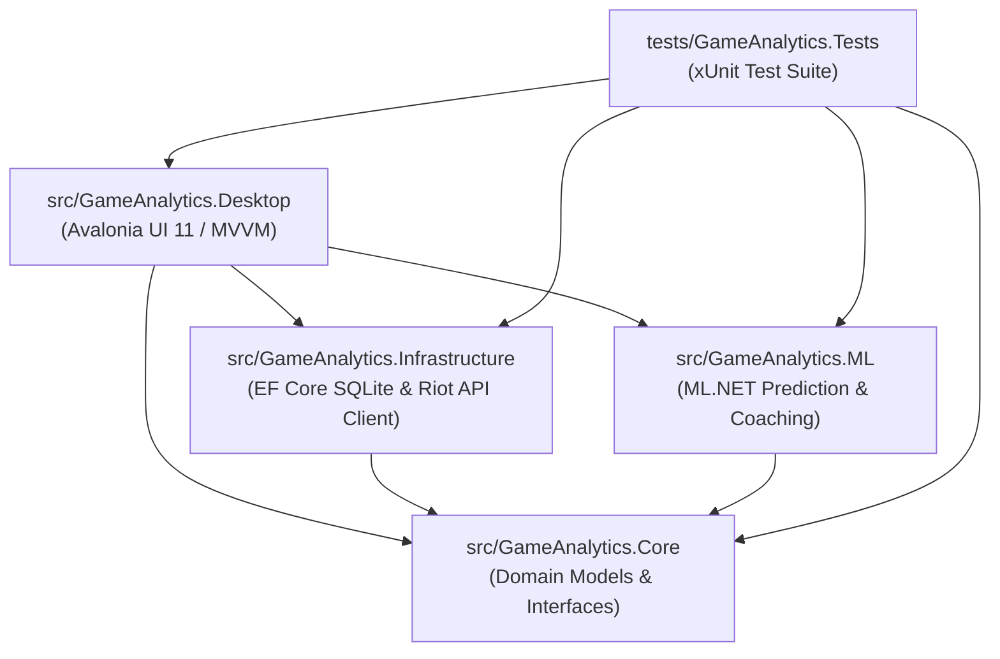

# GameAnalytics

[](https://github.com/Qu4dyz/multiplatform/actions/workflows/build-and-test.yml)
[](https://dotnet.microsoft.com/)
[](https://avaloniaui.net/)
[](https://dotnet.microsoft.com/apps/machinelearning-ai/ml-dotnet)
[](tests/GameAnalytics.Tests)
[-green.svg)]()
[](LICENSE)

GameAnalytics is a cross-platform desktop application built with .NET 9 and Avalonia UI 11 for League of Legends post-match review, player performance coaching, draft synergy evaluation, and machine learning outcome prediction.

Designed for performance and compliance, GameAnalytics operates exclusively on post-match data and public API endpoints without reading game process memory or interfering with the live game client.

---

## Key Features

1. **Summoner Profile & Match History Review (`PlayerAnalyticsView`)**
   - Lookup accounts by Riot ID (e.g. `Qu4dyz#EUW`, `Faker#KR1`) across all Riot regions.
   - Ranked Solo/Duo and Flex tier, LP, win rate, and streak tracking.
   - Per-match breakdown with champion stats, KDA, CS/min, damage share, gold share, vision score, and item builds.
   - Interactive item tooltips displaying item names, gold costs, and full in-game stat breakdowns via DataDragon.
   - Match grading system (MVP, ACE, S/A/B/C/D) evaluating player contribution relative to team totals.
   - Minute-by-minute timeline breakdown identifying key objectives, farm phases, and critical team fights.

2. **Draft Arena & Machine Learning Prediction (`DraftPredictionView`)**
   - 5v5 team draft sandbox (Top, Jungle, Mid, Bot, Support) for Blue and Red teams.
   - Champion catalog with DataDragon icons, role filtering, and search.
   - Win probability estimation powered by ML.NET using binary classification models (`FastTree`, `FastForest`, `SdcaLogisticRegression`).
   - 15-minute game state simulation (Gold Diff, Kill Diff, Dragon/Tower control, First Blood).
   - Real-time feature importance attribution explaining prediction drivers.
   - Model benchmark tool for comparing model accuracy, AUC-ROC, and inference latency.

3. **Performance Momentum & Coaching Engine**
   - Recent form analysis computing player momentum index from recent games.
   - Tilt detection and stamina indicators based on loss streaks and match spacing.
   - Actionable, constructive recommendations on vision control, objective timing, and lane farming.

4. **Local Database & Offline Capability**
   - SQLite relational storage via Entity Framework Core 9 for caching fetched matches and player profiles.
   - Offline / Demo mode allowing full interface exploration without active network calls or API keys.

---

## Riot Games API Integration

GameAnalytics integrates with the official Riot Games API following all developer guidelines and terms of service.

### Endpoints Used

| API Group | Endpoint | Purpose |
| :--- | :--- | :--- |
| **ACCOUNT-V1** | `/riot/account/v1/accounts/by-riot-id/{gameName}/{tagLine}` | Resolve Riot ID to encrypted PUUID |
| **SUMMONER-V4** | `/lol/summoner/v4/summoners/by-puuid/{encryptedPUUID}` | Fetch summoner level, profile icon ID, and revision date |
| **LEAGUE-V4** | `/lol/league/v4/entries/by-puuid/{encryptedPUUID}` | Retrieve ranked solo/duo and flex stats, tiers, and LP |
| **MATCH-V5** | `/lol/match/v5/matches/by-puuid/{puuid}/ids` | Query recent ranked and normal match history list |
| **MATCH-V5** | `/lol/match/v5/matches/{matchId}` | Retrieve full post-game participant statistics and team metrics |
| **MATCH-V5** | `/lol/match/v5/matches/{matchId}/timeline` | Retrieve minute-by-minute timeline frames for objective review |
| **DataDragon** | `https://ddragon.leagueoflegends.com/cdn/{version}/...` | Fetch champion metadata, item definitions, and spell assets (v16.18.1) |

### Rate Limiting & Resilience

- **Sliding-Window Token Bucket (`RiotRateLimiter`):** Enforces local request limits matching Riot API tiers (defaulting to 20 requests per 1 second and 100 requests per 2 minutes for development keys, configurable for production keys).
- **HTTP 429 Handling:** Automatically parses `Retry-After` response headers and applies jittered exponential backoff to ensure requests are queued gracefully rather than rejected.
- **Local Cache First:** Matches fetched from the Riot API are cached in SQLite so identical matches are never re-requested.

### Policy Compliance & Anti-Cheat

- **No Live Memory Access:** GameAnalytics does not read game process memory, inspect network packets, hook DirectX, or inject code into the League of Legends client. It is fully compatible with Riot Vanguard.
- **Post-Game & Pre-Game Only:** All match analytics evaluate completed matches or user-configured draft setups. No real-time competitive advantage is provided during active games.
- **No Toxicity / Shaming:** Performance tags and metrics focus solely on constructive self-improvement and objective team comparisons.
- **Secure Key Storage:** API keys are never embedded in compiled binaries or version control. Keys are stored locally in client application settings.

---

## Architecture

GameAnalytics follows Clean Architecture principles:

```
GameAnalytics/
├── .github/
│   └── workflows/
│       └── build-and-test.yml     # Multiplatform GitHub Actions CI (Linux + Windows)
├── src/
│   ├── GameAnalytics.Core/         # Domain entities (Match, Participant), enums, interfaces
│   ├── GameAnalytics.Infrastructure/ # EF Core 9 SQLite context, Riot API client, DataDragon CDN
│   ├── GameAnalytics.ML/          # ML.NET pipelines (FastTree, FastForest, SDCA), coaching analyzers
│   └── GameAnalytics.Desktop/     # Avalonia UI 11 presentation layer, MVVM ViewModels, Converters
├── tests/
│   └── GameAnalytics.Tests/       # xUnit test suite (46 tests covering data layer, ML, viewmodels)
├── README.md
└── GameAnalytics.sln
```

### Dependency Graph



---

## Technology Stack

| Layer | Technology | Purpose |
| :--- | :--- | :--- |
| **Runtime** | .NET 9.0 (C# 13) | Cross-platform, high-performance managed runtime |
| **User Interface** | Avalonia UI 11.2 | XAML-based cross-platform GUI with hardware-accelerated Skia rendering |
| **MVVM Architecture** | CommunityToolkit.Mvvm 8.4 | Observable properties, relay commands, and messaging source generators |
| **Machine Learning** | ML.NET 4.0 | Binary classification, probability calibration, and feature attribution |
| **Database & Cache** | SQLite + EF Core 9.0 | Local relational storage with automated migrations and entity mapping |
| **HTTP & Serialization** | System.Net.Http + System.Text.Json | Asynchronous HTTP client with rate-limiting handlers and stream parsing |
| **Testing** | xUnit + Coverlet | Unit testing across domain, infrastructure, and ML pipelines (46 tests) |

---

## Getting Started

### Prerequisites

- [.NET 9.0 SDK](https://dotnet.microsoft.com/download/dotnet/9.0) or higher.
- Compatible OS: Windows 10/11 (x64/arm64) or Linux (Ubuntu 22.04+, Debian 12+, Fedora 38+).

On Linux, install required Avalonia rendering dependencies:
```bash
sudo apt update
sudo apt install -y libx11-6 libx11-xcb1 libxcursor1 libxi6 libxrandr2 \
                    libfontconfig1 libice6 libsm6 libgl1-mesa-glx libc6
```

### Build & Run

1. **Clone the repository:**
   ```bash
   git clone https://github.com/Qu4dyz/multiplatform.git
   cd multiplatform
   ```

2. **Restore dependencies & build:**
   ```bash
   dotnet restore
   dotnet build GameAnalytics.sln -c Release
   ```

3. **Run unit tests:**
   ```bash
   dotnet test GameAnalytics.sln
   ```

4. **Launch the desktop application:**
   ```bash
   dotnet run --project src/GameAnalytics.Desktop
   ```

---

## Configuration

To use live data, configure your Riot API key in `appsettings.json` or directly in the application's **Settings** tab:

```json
{
  "RiotApi": {
    "ApiKey": "RGAPI-YOUR-KEY-HERE",
    "PlatformRegion": "euw1",
    "RoutingRegion": "europe"
  },
  "Database": {
    "ConnectionString": "Data Source=game_analytics.db"
  }
}
```

If no API key is provided, GameAnalytics runs in offline demonstration mode using local sample datasets.

---

## Legal Disclaimer

GameAnalytics isn't endorsed by Riot Games and doesn't reflect the views or opinions of Riot Games or anyone officially involved in producing or managing Riot Games properties. Riot Games, and all associated properties are trademarks or registered trademarks of Riot Games, Inc.

---

## License

This project is licensed under the MIT License. See [LICENSE](LICENSE) for details.
