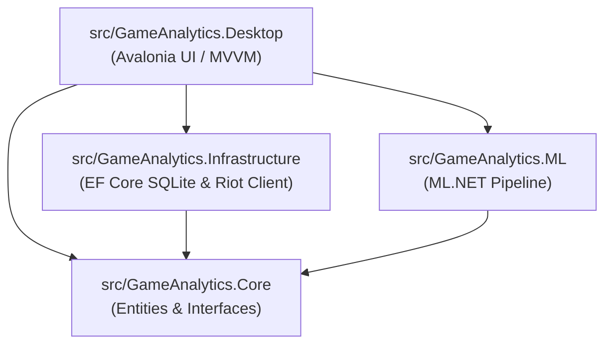

# GameAnalytics — Мультиплатформна система аналізу та прогнозування результатів у змагальних іграх

[](https://dotnet.microsoft.com/)
[](https://avaloniaui.net/)
[](https://dotnet.microsoft.com/apps/machinelearning-ai/ml-dotnet)
[-green.svg)]()
[](LICENSE)

Курсовий проєкт з навчальної дисципліни **«Мультиплатформне програмування»**.  
**Автор:** [@Qu4dyz](https://github.com/Qu4dyz)  
**Предметна область:** Аналіз соревновальних рейтингових матчів (League of Legends через Riot Games API), збір внутрішньоігрової статистики (склади команд, показники чемпіонів, об'єкти карти, перевага за золотом) та прогнозування ймовірності перемоги методами машинного навчання.

---

## 🎯 Мета та завдання проєкту

Головна мета — розробка високопродуктивної, повністю кросплатформеної системи на базі сучасного стеку .NET, яка забезпечує:
1. **Аналітику гравців:** Отримання актуальної інформації про обліковий запис гравця, його ранг, KDA, популярних чемпіонів та відсоток перемог (Win Rate).
2. **Аналіз драфту та прогнозування:** Інтерактивний вибір сетапів чемпіонів або ранньоігрових показників (перша кров, перша вежа, перевага за золотом/вбивствами на 15-й хвилині) та розрахунок ймовірності перемоги натренованою моделлю бінарної класифікації **ML.NET**.
3. **Історію та кешування матчів:** Локальне зберігання звітів та метрик у реляційній базі даних **SQLite** за допомогою **Entity Framework Core**.
4. **Уніфікований нативний інтерфейс:** Однаковий сучасний графічний інтерфейс (Dark Theme) під ОС **Windows** та **Linux (Debian/Ubuntu)** без змін у вихідному коді.

---

## 🛠 Технологічний стек

| Компонент | Технологія / Бібліотека | Опис |
| :--- | :--- | :--- |
| **Мова та платформа** | **C# 13 / .NET 9** | Сучасне ядро з високою продуктивністю та кросплатформеністю |
| **Графічний інтерфейс (GUI)** | **Avalonia UI 11** | Кросплатформенний UI фреймворк на основі XAML з нативним рендерингом |
| **Архітектурний патерн** | **MVVM (Model-View-ViewModel)** | Реалізовано за допомогою `CommunityToolkit.Mvvm` (Source Generators) |
| **Машинне навчання (ML)** | **ML.NET 4.0 (FastTree / LightGBM)** | Повний пайплайн навчання та передбачення всередині C# рантайму |
| **База даних & ORM** | **SQLite + Entity Framework Core 9** | Локальне кешування, міграції та реляційні зв'язки |
| **Мережевий шар** | **HttpClient + System.Text.Json** | Робота з публічним REST API Riot Games, обробка рейт-лімітів (429) |
| **DI Контейнер** | **Microsoft.Extensions.DependencyInjection** | Впровадження залежностей та слабозв'язана архітектура |

---

## 🏗 Архітектура рішення (.NET Solution)

Проєкт спроєктовано за принципами чистої модульної архітектури (Clean Architecture):

```
GameAnalytics/
├── .github/
│   └── ISSUE_TEMPLATE/            # Шаблони баг-репортів та запитів на фічі
│       ├── bug_report.md
│       └── feature_request.md
├── src/
│   ├── GameAnalytics.Core/         # Доменний шар: сутності (Match, Participant), перерахування, інтерфейси
│   ├── GameAnalytics.Infrastructure/ # Інфраструктура: EF Core (SQLite DbContext), Riot API клієнт, репозиторії
│   ├── GameAnalytics.ML/          # Машинне навчання: фічі (MatchInputData), передбачення, пайплайни ML.NET
│   └── GameAnalytics.Desktop/     # Презентаційний шар: Avalonia UI (Views, ViewModels, Dark Theme)
├── .gitignore                     # Правила виключення бінарників, баз даних і секретних ключів
├── README.md                      # Документація проєкту
└── GameAnalytics.sln              # Файл Solution
```

### Граф залежностей проєктів:


---

## 💻 Підтримувані платформи та системні вимоги

### 1. Windows (10 / 11 x64 / arm64)
- Встановлений **.NET 9 SDK** (або новіший).
- Графічний адаптер із підтримкою DirectX 11 / OpenGL.

### 2. Linux (Debian 11/12, Ubuntu 22.04/24.04 LTS x64)
Для запуску графічної підсистеми Avalonia на дистрибутивах Linux на базі Debian потрібні наступні системні пакети:
```bash
sudo apt update
sudo apt install -y libx11-6 libx11-xcb1 libxcursor1 libxi6 libxrandr2 \
                    libfontconfig1 libice6 libsm6 libgl1-mesa-glx libc6
```

---

## 🚀 Інструкція зі збирання та запуску

### Крок 1. Клонування репозиторію
```bash
git clone https://github.com/Qu4dyz/multiplatform.git
cd multiplatform
```

### Крок 2. Відновлення пакетів та компіляція
```bash
# Відновити всі NuGet-залежності
dotnet restore

# Зібрати проєкт у конфігурації Release
dotnet build GameAnalytics.sln -c Release
```

### Крок 3. Запуск застосунку
```bash
# Запуск кросплатформеного GUI-клієнта
dotnet run --project src/GameAnalytics.Desktop
```

---

## ⚙️ Конфігурація Riot Games API

Для доступу до живих даних Riot Games (EUW, EUNE тощо):
1. Отримайте персональний Development API Key на порталі [Riot Developer Portal](https://developer.riotgames.com/).
2. Створіть файл `src/GameAnalytics.Desktop/appsettings.json` (або `appsettings.Development.json`):
```json
{
  "RiotApi": {
    "ApiKey": "RGAPI-XXXXXXXX-XXXX-XXXX-XXXX-XXXXXXXXXXXX",
    "Region": "eun1",
    "RoutingRegion": "europe"
  },
  "Database": {
    "ConnectionString": "Data Source=game_analytics.db"
  }
}
```
> [!NOTE]
> Якщо API-ключ не вказано, система автоматично перемикається в **демонстраційний / автономний режим (Mock Mode)**, що дозволяє повноцінно тестувати інтерфейс та ML-прогнозування без активного підключення до серверів Riot Games.

---

## 🤝 Розробка та контрибуція

- **Гілка за замовчуванням:** `main`.
- Для нових функцій створюйте окремі гілки: `git checkout -b feature/назва-фічі`.
- Перед відправкою змін переконайтеся у відсутності помилок: `dotnet build`.
- Використовуйте шаблони Issues у розділі [GitHub Issues](https://github.com/Qu4dyz/multiplatform/issues).
